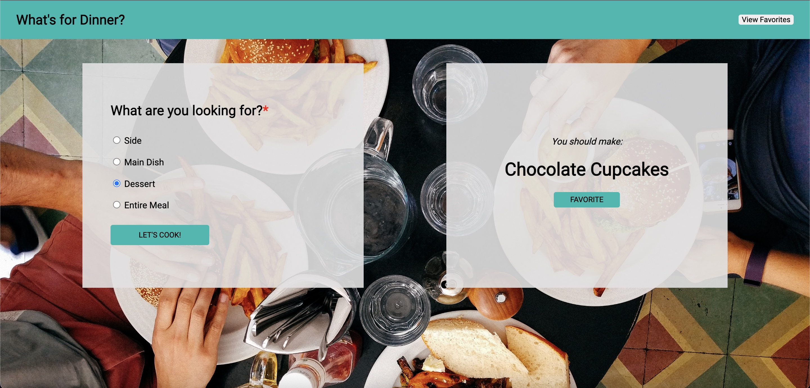

# What's for Dinner? 

### Abstract:

[//]: <> (Briefly describe what you built and its features. What problem is the app solving? How does this application solve that problem?)
An app that helps users choose a dish from a set of options.  This app solves the crushing agony that is chosing what to eat, day in and day out.  This app randomly selects a dish based on whether the user want a meal, a side, or a dessert and displays that dish to the user. 

### Installation Instructions:
[//]: <> (What steps does a person have to take to get your app cloned down and running?)
- Clone the repository to your local machine
- `cd` into the project
- Open with project from the terminal by typing `open main.js`

### Preview of App:
[//]: <> (Provide ONE gif or screenshot of your application - choose the "coolest" piece of functionality to show off.)

### Context:
[//]: <> (Give some context for the project here. How long did you have to work on it? How far into the Turing program are you?)
This is the second individual project in Mod 1 at Turing. I had 5 days to complete it.

### Contributors:
[//]: <> (Who worked on this application? Link to their GitHubs.)
Ian Nordby - https://github.com/nordbyi

### Learning Goals:
[//]: <> (What were the learning goals of this project? What tech did you work with?)
The goal of this project was to create an app from the ground up based on a comp.  This project is the first project where we had to create CSS and HTML from scratch.  We also need to create the JavaScript from scratch and use it (in conjenction with HTML) to listen to and respond to user events.

### Wins + Challenges:
[//]: <> (What are 2-3 wins you have from this project? What were some challenges you faced - and how did you get over them?)
Biggest win is getting the look somewhat close to the comp using CSS for the first time. I also made good progress in understanding how to construct HTML.  